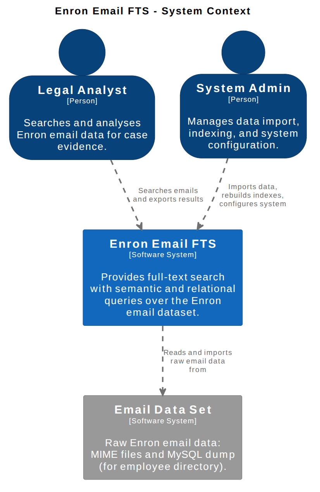
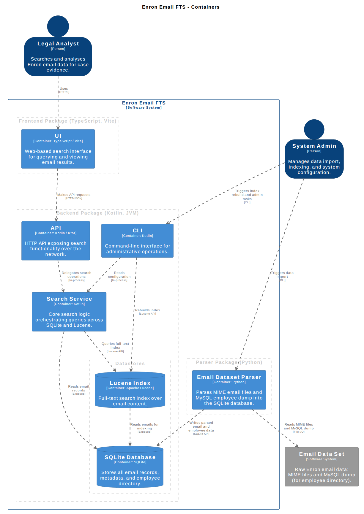
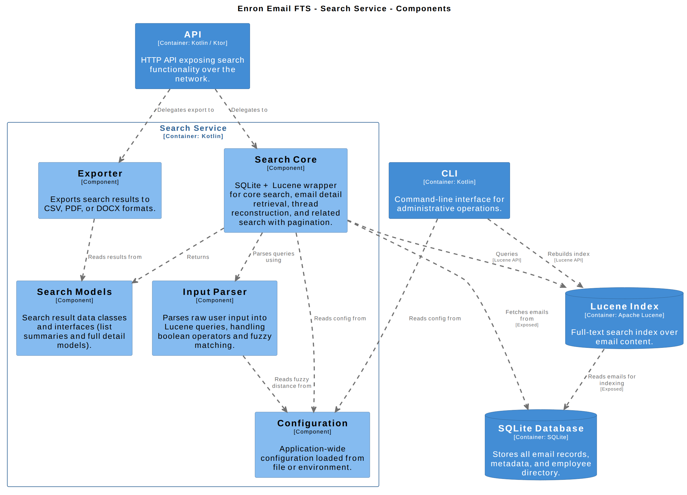
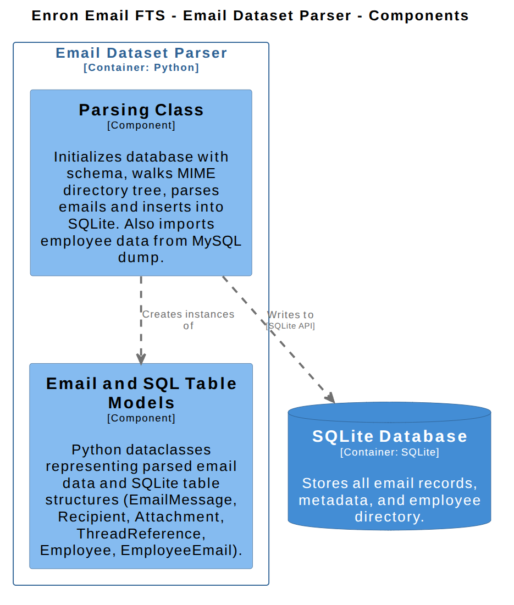
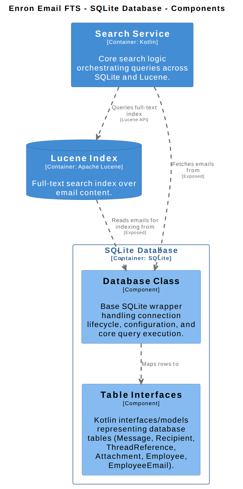
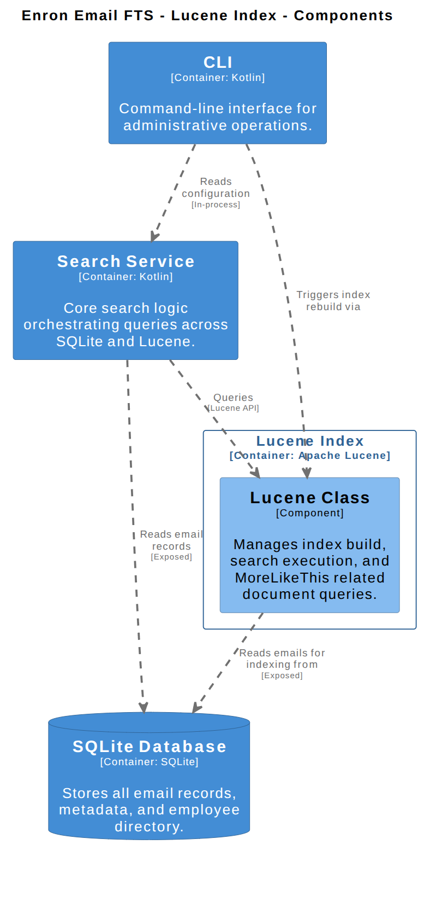
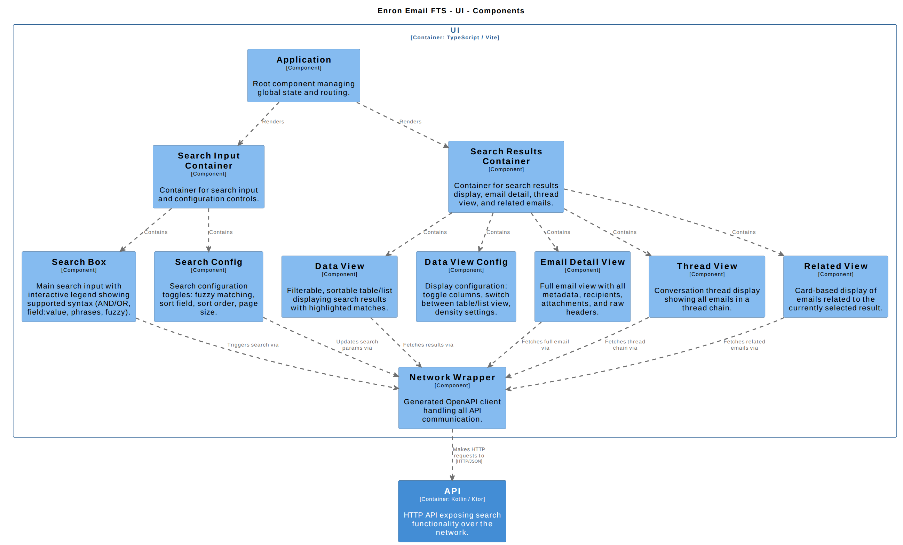

# Email FTS - Full Text Search for Enron Email Database

This project is a full text relational and semantic search system for email files in the context of legal analysis, specifically for the widely available 2002 Enron email data set, although there are provisions and features to adapt to other email sources.

A full description of requirements can be found in [task-description.md](./task-description.md).

The motives were as a technical challenge and demonstration of my system architecture and software engineering skills.

### Usage Instructions

All package build scripts have been integrated with gradle, to build and run the project:

```bash
# navigate to the search-server package
cd ./packages/search-server/

# runs data ingestion, builds web client & search server
gradle build

# runs the search server and serves the web client
gradle run
```

The data ingestion pipeline will require the email data dump files `enron_mail_20150507.tar.gz` and `enron-mysqldump_v5.sql.gz` to be in the `./packages/data-ingest/src/data_ingest/data` directory, and it will take a few minutes to process them into a SQLite database.

Further usage details and links to download the data files are in the data ingestion package [README.md](./packages/data-ingest/README.md)


### Technical Architecture

The project consists of three packages:

- A python data ingestion parser to convert MIME email files into a relational SQLite database
- A kotlin search server that handles a full text search functionality using the SQLite database and Apache Lucene, it also has a RESTful HTTP interface to provide its functionality to the web frontend client.
- A typescript web client for using the search service

Here are C4 Model Diagrams representing the System Context and the complete System Containers and their relationships.

<details>
<summary>System Context Diagram</summary>


</details>

<details>
<summary>System Containers Diagram</summary>


</details>

<p></p>

Here are diagrams of the individual System Containers & Components with relationships:

<details>
<summary>Search Service</summary>


</details>

<details>
<summary>Email Data Ingestion</summary>


</details>

<details>
<summary>SQLite Database Store</summary>


</details>

<details>
<summary>Lucene Index Store</summary>


</details>


<details>
<summary>Front-end Web Client UI</summary>


</details>


-- screenshots of the frontend client


### Development process

The task was analysed and researched then an appropriate system carefully planned using the C4 modelling system and structurizr DSL before being implemented with a mix of agentic coding (data ingestion + web client) and documentation reading and hand coding (main kotlin search server).

Documentation explaining and for the system architecture is in the [./planning/](./planning/) directory:

1.  [./planning/1-research-discussion.md](./planning/1-research-discussion.md)
    Summary of some of the initial research and LLM discussion on the task

2.  [./planning/2-my-architecture.md](./planning/2-my-architecture.md)
    Contains all my own thoughts and reasonings on a system architecture as well as a concrete beginnings on the C4 models Containers and Components

3.  [./planning/3-architecture-diagrams.dsl](./planning/3-architecture-diagrams.dsl)
    This contains the C4 model system architecture in the structurizr DSL format. This was created by me based on the initial containers and components description and then refined in an iterative process with an LLM agent.

4.  [./planning/4-data-import-schema.md](./planning/4-data-import-schema.md)
    Contains the data ingestion specifications, this file was iterated on with an LLM based on the structurizr DSL and used to produce the data ingestion script.

5.  [./planning/./planning/5-architecture-code.md](./planning/5-architecture-code.md)
    Contains prototype code specifications and interfaces for all C4 Containers and their Components, mostly generated in one shot based on C4 specification and then used as a reference in both agentic and non-agentic development.

There is also a more detailed development log and notes in [DEV.md](./DEV.md).


### Conclusions

Although this would still require some further work to become a production ready system, it covers all the core fundamentals of every component of the system, and I learnt a lot in the week I spent developing it.

###### Q&A

Common issues I encountered while handling, indexing and searching large corpus of unstructured text?
- identifying whats useful knowledge information from the source data and metadata therein
- identifying and creating relationships between the discerned data information and metadata, and creating appropriate schemas
- optimizing data ingestion methods and operations (batching, system resource management)
- optimizing index building methods and operations
- researching the fundamental text analysis and indexing methods and mathematical formula/algorithms required for semantic full text search (n-gram indexes, Jaccard similarity, Levenshtein automaton / distances, edit distances, BestMatch25) and deciding whether to implement them vs using an external FTS solution/library - decided on Lucene as it incorporated the most of these fundamental methods and provided clean and configurable API
- considerations choosing and configuring different methods to index and search data for free text search: tokenization methods (text analyzers, which fields and how to store them), query parsing (input formats, filtering specifier formats, fuzzy matching distances and input term selection, weights on input terms) and querying methods (,,,)
- data presentation layer

How would I scale to a much larger dataset (gigabytes/petabytes)?
- due to index size and system resource constraints at those scales this would require sharding over multiple lucine indexes with synchronized sharding of the relational SQLite database
- these are complicated systems to build, instead would probably use Elasticsearch and a postgresql/sqlite sharding solution
- might be better to consider document store engines over relational which have better support for distributed systems
- would require orchestration layer with request routing, load balancing, etc

How would I scale to multiple users?
- lucene-replicator for index replication across nodes
- also replication of sqlite database
- load balanced orchestartion via kubernetes
- application code changes for thread safety / event bus synchronization

What would I improve if given more time to complete the task?
- spend more time in the planning and analysis stage and data analysis on the email format to prevent schema changes during development
- investigated other forensic email analysis tools in relation to the prior point
- test development
- lucene indexing and querying configuration
- end user client usability
