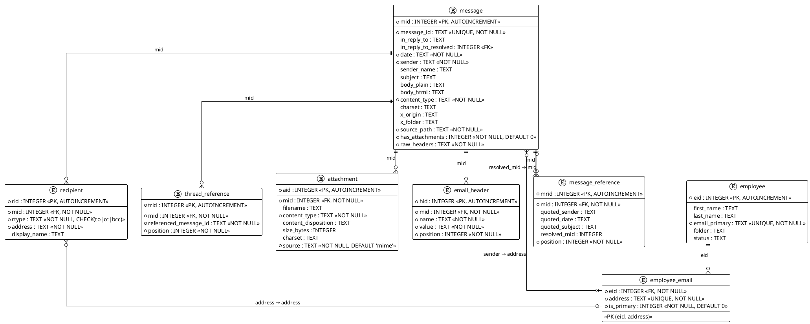

# Data Schema

## PlantUML - Database Relations



## SQLite Database Schema

```sql
-- Core email message metadata
CREATE TABLE message (
    mid         INTEGER PRIMARY KEY AUTOINCREMENT,
    message_id  TEXT NOT NULL UNIQUE,  -- MIME Message-ID header
    in_reply_to TEXT,                  -- MIME In-Reply-To header
    in_reply_to_resolved INTEGER,      -- Backfilled FK to message(mid) from resolved quoted references (NULL if unresolvable)
    date        TEXT NOT NULL,         -- ISO 8601 with timezone offset (e.g. 2001-10-29T14:30:00-06:00)
    sender      TEXT NOT NULL,         -- From header email address
    sender_name TEXT,                  -- From header display name
    subject     TEXT,
    body_plain  TEXT,                  -- Plain text body
    body_html   TEXT,                  -- HTML body (if present)
    content_type TEXT NOT NULL,        -- Top-level Content-Type (e.g. multipart/mixed)
    charset     TEXT,                  -- Character encoding of the body
    x_origin    TEXT,                  -- X-Origin header (mailbox provenance)
    x_folder    TEXT,                  -- X-Folder header (original folder path)
    source_path TEXT NOT NULL,         -- Filesystem path of the original MIME file
    has_attachments INTEGER NOT NULL DEFAULT 0,  -- Denormalised flag for quick filtering
    raw_headers TEXT NOT NULL          -- Complete original MIME headers preserved as-is for analysis
);

-- Recipients normalised per type, one row per recipient per message
CREATE TABLE recipient (
    rid         INTEGER PRIMARY KEY AUTOINCREMENT,
    mid         INTEGER NOT NULL REFERENCES message(mid) ON DELETE CASCADE,
    rtype       TEXT NOT NULL CHECK (rtype IN ('to', 'cc', 'bcc')),
    address     TEXT NOT NULL,
    display_name TEXT
);

-- Threading references, one row per referenced message_id per message
-- Preserves the full References header chain in order
CREATE TABLE thread_reference (
    trid        INTEGER PRIMARY KEY AUTOINCREMENT,
    mid         INTEGER NOT NULL REFERENCES message(mid) ON DELETE CASCADE,
    referenced_message_id TEXT NOT NULL,  -- A single Message-ID from the References header
    position    INTEGER NOT NULL          -- Order in the References chain (0 = oldest ancestor)
);

-- Attachment metadata (not the binary content)
CREATE TABLE attachment (
    aid         INTEGER PRIMARY KEY AUTOINCREMENT,
    mid         INTEGER NOT NULL REFERENCES message(mid) ON DELETE CASCADE,
    filename    TEXT,
    content_type TEXT NOT NULL,           -- MIME type (e.g. application/pdf)
    content_disposition TEXT,             -- inline or attachment
    size_bytes  INTEGER,                  -- Decoded content size
    charset     TEXT,                     -- Encoding if text-based attachment
    source      TEXT NOT NULL DEFAULT 'mime' -- 'mime' = from MIME part, 'body_reference' = inferred from <<filename>> in body text
);

-- Employee directory (imported from MySQL dump: planning/resources/*.sql.gz)
-- This data must be imported from the MySQL dump as it would be complex to reconstruct from MIME files alone.
-- The original dump contains manually curated employee-to-email mappings and job status data.
CREATE TABLE employee (
    eid         INTEGER PRIMARY KEY AUTOINCREMENT,
    first_name  TEXT,
    last_name   TEXT,
    email_primary TEXT NOT NULL UNIQUE,
    folder      TEXT,                     -- Original mailbox folder name
    status      TEXT                      -- Last known job title/position
);

-- Bridge table mapping employees to all their known email addresses.
-- Imported from the MySQL dump's employeelist table (Email_id, Email2, Email3, Email4 columns).
-- Enables simple JOINs on a single address column rather than matching against multiple alt columns.
CREATE TABLE employee_email (
    eid         INTEGER NOT NULL REFERENCES employee(eid) ON DELETE CASCADE,
    address     TEXT NOT NULL UNIQUE,     -- Email address (primary or alternate)
    is_primary  INTEGER NOT NULL DEFAULT 0, -- 1 if this is the canonical address (Email_id), 0 for alternates
    PRIMARY KEY (eid, address)
);

-- Normalized email headers, one row per header per message.
-- Stores all MIME headers for structured querying and display.
-- Headers with legal analysis value include:
--   X-From/X-To/X-cc/X-bcc: Lotus Notes internal directory paths revealing org unit and CN
--   X-FileName: PST/NSF archive name establishing chain of custody
--   Content-Transfer-Encoding: relevant if encoding corruption is alleged
-- Note: forensic headers (X-Originating-IP, X-Authentication-Warning, Received chains)
-- appear only inside body text of forwarded messages in this dataset, not as top-level MIME headers.
CREATE TABLE IF NOT EXISTS email_header (
    hid         INTEGER PRIMARY KEY AUTOINCREMENT,
    mid         INTEGER NOT NULL REFERENCES message(mid) ON DELETE CASCADE,
    name        TEXT NOT NULL,           -- Header name as-is from MIME (e.g. "X-From", "Content-Type")
    value       TEXT NOT NULL,           -- Decoded header value
    position    INTEGER NOT NULL         -- Order of appearance in the original headers (0-based)
);

-- Quoted reply/forward references, parsed from body_plain during import.
-- Reconstructs thread links by extracting inline-quoted headers from email bodies.
-- Each row represents one quoted block (emails can contain multiple nested quotes).
-- Note: This serves a similar purpose to the MySQL dump's `referenceinfo` table,
-- which also stores quoted email content. However, we parse directly from body_plain
-- rather than importing referenceinfo, giving us coverage for all emails rather than
-- only the ~54k rows in that table.
CREATE TABLE IF NOT EXISTS message_reference (
    mrid            INTEGER PRIMARY KEY AUTOINCREMENT,
    mid             INTEGER NOT NULL REFERENCES message(mid) ON DELETE CASCADE,
    quoted_sender   TEXT,           -- Parsed From/sender in the quoted block
    quoted_date     TEXT,           -- Parsed Sent/Date in the quoted block (ISO 8601 when parseable)
    quoted_subject  TEXT,           -- Parsed Subject in the quoted block
    resolved_mid    INTEGER,        -- FK to message(mid) if the quoted email was matched
    position        INTEGER NOT NULL -- Order of quote in the email (0 = most recent/innermost)
);

-- Indexes for common query patterns
CREATE INDEX IF NOT EXISTS idx_message_sender      ON message(sender);
CREATE INDEX IF NOT EXISTS idx_message_date        ON message(date);
CREATE INDEX IF NOT EXISTS idx_message_message_id  ON message(message_id);
CREATE INDEX IF NOT EXISTS idx_message_in_reply_to ON message(in_reply_to);
CREATE INDEX IF NOT EXISTS idx_message_reply_resolved ON message(in_reply_to_resolved);
CREATE INDEX IF NOT EXISTS idx_recipient_mid       ON recipient(mid);
CREATE INDEX IF NOT EXISTS idx_recipient_address   ON recipient(address);
CREATE INDEX IF NOT EXISTS idx_thread_ref_mid      ON thread_reference(mid);
CREATE INDEX IF NOT EXISTS idx_thread_ref_ref_id   ON thread_reference(referenced_message_id);
CREATE INDEX IF NOT EXISTS idx_attachment_mid      ON attachment(mid);
CREATE INDEX IF NOT EXISTS idx_employee_email      ON employee(email_primary);
CREATE INDEX IF NOT EXISTS idx_employee_email_addr ON employee_email(address);
CREATE INDEX IF NOT EXISTS idx_employee_email_eid  ON employee_email(eid);
CREATE INDEX IF NOT EXISTS idx_header_mid           ON email_header(mid);
CREATE INDEX IF NOT EXISTS idx_header_name          ON email_header(name);
CREATE INDEX IF NOT EXISTS idx_header_name_value    ON email_header(name, value);
CREATE INDEX IF NOT EXISTS idx_msg_ref_mid         ON message_reference(mid);
CREATE INDEX IF NOT EXISTS idx_msg_ref_resolved    ON message_reference(resolved_mid);
CREATE INDEX IF NOT EXISTS idx_msg_ref_sender      ON message_reference(quoted_sender);
```

## Python Models

```python
"""Email data models for MIME parsing and SQLite storage."""

from dataclasses import dataclass, field
from datetime import datetime


@dataclass
class Recipient:
    """A single email recipient with type classification."""
    rtype: str          # "to", "cc", or "bcc"
    address: str
    display_name: str | None = None


@dataclass
class ThreadReference:
    """A single entry from the References header chain."""
    referenced_message_id: str
    position: int       # 0 = oldest ancestor in the chain


@dataclass
class Attachment:
    """Metadata for a single MIME attachment (no binary content)."""
    filename: str | None
    content_type: str
    content_disposition: str | None  # "inline" or "attachment"
    size_bytes: int | None
    charset: str | None = None
    source: str = "mime"             # "mime" = from MIME part, "body_reference" = from <<filename>> in body text


@dataclass
class EmailHeader:
    """A single email header name/value pair."""
    name: str
    value: str
    position: int                    # Order in original headers (0-based)


@dataclass
class EmployeeEmail:
    """A single email address associated with an employee."""
    address: str
    is_primary: bool  # True if this is the canonical address (Email_id from the MySQL dump)


@dataclass
class Employee:
    """Employee directory entry. Imported from MySQL dump (planning/resources/*.sql.gz)."""
    first_name: str | None
    last_name: str | None
    email_primary: str
    folder: str | None = None
    status: str | None = None
    email_addresses: list[EmployeeEmail] = field(default_factory=list)  # All known addresses (via employee_email bridge)


@dataclass
class MessageReference:
    """A resolved quoted reply/forward reference row in the message_reference table.
    Note: Currently unused in the parser — QuotedReference is used during import.
    Exists for completeness with the database schema."""
    mid: int
    quoted_sender: str | None
    quoted_date: str | None
    quoted_subject: str | None
    resolved_mid: int | None
    position: int


@dataclass
class QuotedReference:
    """A single quoted reply/forward block parsed from an email body."""
    quoted_sender: str | None
    quoted_date: str | None         # ISO 8601 when parseable, raw string otherwise
    quoted_subject: str | None
    position: int                   # 0 = most recent/innermost quote


@dataclass
class EmailMessage:
    """Complete parsed representation of a single MIME email."""
    message_id: str
    in_reply_to: str | None
    date: datetime                   # Timezone-aware
    sender: str
    sender_name: str | None
    subject: str | None
    body_plain: str | None
    body_html: str | None
    content_type: str
    charset: str | None
    x_origin: str | None
    x_folder: str | None
    source_path: str
    has_attachments: bool
    raw_headers: str                 # Complete original MIME headers as-is
    recipients: list[Recipient] = field(default_factory=list)
    thread_references: list[ThreadReference] = field(default_factory=list)
    attachments: list[Attachment] = field(default_factory=list)
    quoted_references: list[QuotedReference] = field(default_factory=list)
    headers: list[EmailHeader] = field(default_factory=list)
```

## Design Notes

### `raw_headers` field
Complete original MIME headers preserved as a single text blob. This ensures no header data is lost even if specific columns don't capture a particular header. Useful for ad-hoc analysis of non-standard headers (e.g. `X-Mailer`, `Received` chains for routing analysis, custom Enron-internal headers) without requiring schema changes.

### Denormalised fields
- `has_attachments` on `message` avoids a JOIN for the common "filter emails with attachments" query
- `sender`/`sender_name` on `message` avoids a JOIN to `recipient` for the most common display case
- `employee.email_primary` duplicates the `employee_email` row where `is_primary = 1` — this is intentional denormalisation for quick lookups without joining the bridge table, but **both must be kept in sync during import** (the parser should write to both `employee.email_primary` and insert the corresponding `employee_email` row with `is_primary = 1`)

### Threading
Three-tier thread reconstruction approach:
- **Primary**: `in_reply_to` on `message` gives direct parent lookup via MIME In-Reply-To header (original header value, never modified by the parser)
- **Secondary**: `thread_reference` table preserves the full `References` header chain with ordering (from MIME References header — mostly absent in the Enron dataset)
- **Tertiary**: `message_reference` table stores quoted reply/forward metadata parsed from `body_plain` during import. The parser detects `-----Original Message-----` and `-----Forwarded by...-----` separators, extracts embedded From/Sent/Subject headers, and after all emails are imported, attempts to resolve each quoted block to an actual `message.mid` by matching sender+subject. Successfully resolved references are also backfilled into `in_reply_to_resolved` (the position 0 / most recent quote's resolved mid). This provides significantly broader thread coverage than MIME headers alone (~54k+ emails have quoted content)
- The search server should check `in_reply_to` first (authoritative MIME header), then fall back to `in_reply_to_resolved` (integer FK to mid), then consult `message_reference` for the full quote chain

Note: The MySQL dump contains a `referenceinfo` table with similar quoted email content (~54,778 rows). We parse directly from `body_plain` instead of importing `referenceinfo` because: (a) it gives coverage for all emails, not just those in the dump, and (b) the MIME source is the authoritative data source for this project

### Body storage
- `body_plain` and `body_html` stored separately to avoid re-parsing multipart content
- Lucene indexes plain text; UI can render HTML version

### Employee ↔ Message relationship
- Not enforced as a foreign key since many email addresses in the dataset won't match an employee record (external contacts)
- Linked via `sender`/`recipient.address` → `employee_email.address` → `employee.eid` at query time
- The `employee_email` bridge table flattens the original MySQL dump's `Email_id`/`Email2`/`Email3`/`Email4` columns into normalised rows, enabling simple single-column JOINs

### Employee data import
- The `employee` and `employee_email` tables must be imported from the MySQL dump (`planning/resources/*.sql.gz`) as part of the data import pipeline
- The employee-to-email mappings were manually curated by the dataset maintainer and would be complex to reconstruct from the MIME files alone
- The parser should extract `employeelist` rows from the MySQL dump and pivot the `Email_id`/`Email2`/`Email3`/`Email4` columns into `employee_email` rows
